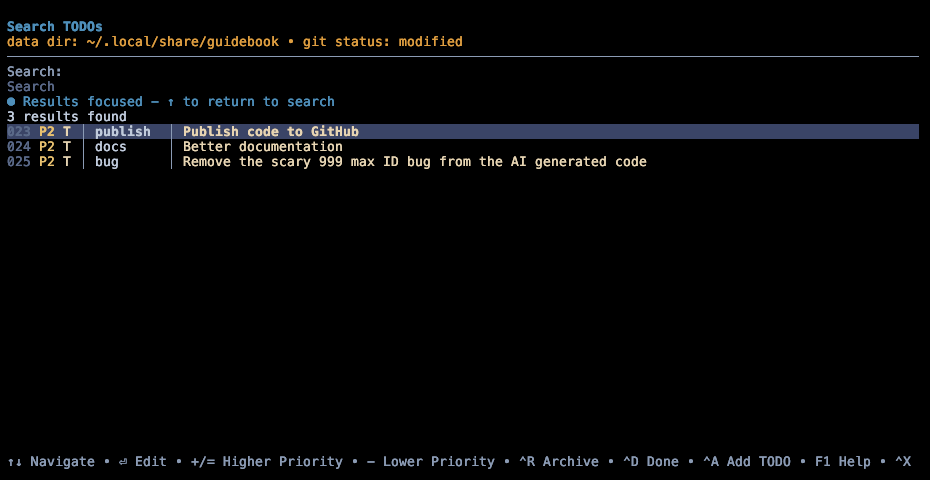

# 🍁 guidebook-todo

A terminal-based, personal todo application written in Rust that stores your todo list on GitHub in a private repo. As a "personal" todo manager, it is intended for use by a single user (not teams).



## Status

Early but functional prototype `:)`

## Features

-   **Terminal-first design** - built to be used without leaving the terminal
-   **Interactive TUI** - terminal interface for adding, editing, and searching
-   **YAML file format** - human-readable files you own and control
-   **Git integration** - GitHub data storage for sync and revision history
-   **Fast search** - search syntax with fuzzy matching

## Installation

**Requires**: [Rust](https://rustup.rs/) to be installed for installation.

```bash
cargo install --git https://github.com/raiment-studios/guidebook-todo
```

## Usage

**Initialization**: on your first use, run `guidebook-plan init` to initialize the local and/or remote data directory. This only has to be run once per computer.

```bash
guidebook-todo init
```

Then to use the app (sorry these docs could be better!)

```bash
# Add a new TODO interactively
guidebook-todo add

# Search and manage TODOs interactively
guidebook-todo search

# Add with title directly
guidebook-todo add "Fix the login bug"

# Quick add with defaults
guidebook-todo add --quick "Review pull request"

# List all active TODOs
guidebook-todo list

# Edit a specific TODO
guidebook-todo edit 42

# Show TODO details
guidebook-todo show 42
```

### Interactive Search

The search interface is the primary way to browse and manage your TODOs:

```bash
guidebook-todo search
```

**Search Features:**

-   **Fuzzy matching** - Type partial words to find matches
-   **Tag search** - Use `#tag` to filter by tags
-   **Category search** - Use `@category` to filter by category
-   **Status search** - Use `!status` to filter by status
-   **Priority search** - Use `p0`, `p1`, etc. to filter by priority

**Keyboard shortcuts:**

-   `↑↓` - Navigate results
-   `⏎` - Edit selected TODO
-   `+/=` - Increase priority
-   `-` - Decrease priority
-   `⌃R` - Archive TODO
-   `⌃D` - Mark as done
-   `⌃A` - Add new TODO
-   `/` - Focus search input
-   `⌃X` - Exit

## Development

### Contributing

Probably a bit early to accept contributions, but do get in touch if you're interested!

### Roadmap

#### v0.1

-   [ ] User testing to make sure it's a valuable app!
-   [ ] Develop a roadmap

### History

The original prototype was created in July 2025 using Claude Sonnet 4. Subjectively, I do not think the AI was used in any way that unfairly took advantage of any novel work by others people (at least not directly) as the AI was used to construct the bare bones of a well-known class of application (a todo app) that utilizes open source libraries. However, if you are entirely against using tools whose creation included use of AI, please consider this your disclosure about the origins of the original codebase!

## FAQ

TODO

## License

[MIT License](LICENSE) - see the LICENSE file for details.
