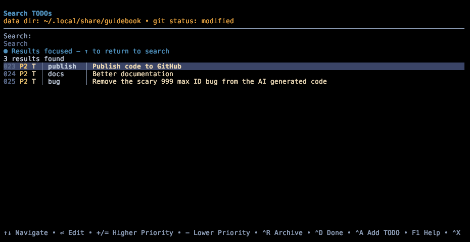

# 🍁 guidebook-todo

A terminal-based, personal todo application written in Rust that stores your todo list on GitHub in a private repo or locally. As a "personal" todo manager, it is intended for use by a single user (not teams).



## Status

Early but functional prototype `:)`

## Features

-   **Terminal-first design** - Built for keyboard-driven productivity
-   **Interactive TUI** - terminal interface for adding, editing, and searching
-   **Local YAML storage** - Human-readable files you own and control
-   **Git integration** - Version control and GitHub sync for backup and collaboration
-   **Fast search** - Advanced search syntax with fuzzy matching
-   **Smart filtering** - Hide completed tasks after 3 seconds, archive old items
-   **Cross-platform** - Works on macOS, Linux, and Windows

## Installation

**Requires**: [Rust](https://rustup.rs/) to be installed for installation.

```bash
cargo install --git https://github.com/raiment-studios/guidebook-plan
```

## Usage

**Initialization**: on your first use, run `guidebook-plan init` to initialize the local and/or remote data directory. This only has to be run once per computer.

```bash
guidebook-todo init
```

Then to use the app (sorry these docs could be better!)

```bash
# Add a new TODO interactively
guidebook-todo add

# Search and manage TODOs interactively
guidebook-todo search

# Add with title directly
guidebook-todo add "Fix the login bug"

# Quick add with defaults
guidebook-todo add --quick "Review pull request"

# List all active TODOs
guidebook-todo list

# Edit a specific TODO
guidebook-todo edit 42

# Show TODO details
guidebook-todo show 42
```

### Interactive Search

The search interface is the primary way to browse and manage your TODOs:

```bash
guidebook-todo search
```

**Search Features:**

-   **Fuzzy matching** - Type partial words to find matches
-   **Tag search** - Use `#tag` to filter by tags
-   **Category search** - Use `@category` to filter by category
-   **Status search** - Use `!status` to filter by status
-   **Priority search** - Use `p0`, `p1`, etc. to filter by priority

**Keyboard shortcuts:**

-   `↑↓` - Navigate results
-   `⏎` - Edit selected TODO
-   `+/=` - Increase priority
-   `-` - Decrease priority
-   `⌃R` - Archive TODO
-   `⌃D` - Mark as done
-   `⌃A` - Add new TODO
-   `/` - Focus search input
-   `⌃X` - Exit

## Commands

### Core Commands

```bash
guidebook-todo                    # Show overview of active TODOs
guidebook-todo add [TITLE]       # Add new TODO (interactive or with title)
guidebook-todo list              # List TODOs with filtering options
guidebook-todo search [QUERY]    # Interactive search and management
guidebook-todo edit <ID>         # Edit specific TODO
guidebook-todo show <ID>         # Show TODO details
guidebook-todo stats             # Show statistics
```

### Management Commands

```bash
guidebook-todo update <ID>       # Update TODO properties via CLI
guidebook-todo delete <ID>       # Delete specific TODO
guidebook-todo push              # Sync changes to GitHub
guidebook-todo code              # Open raw TODO file in VS Code
```

### Filtering Options

The `list` command supports filtering:

```bash
guidebook-todo list --status done           # Show completed TODOs
guidebook-todo list --priority p0           # Show urgent TODOs
guidebook-todo list --category work         # Show work-related TODOs
guidebook-todo list --tags "bug,frontend"   # Show TODOs with specific tags
guidebook-todo list --all                   # Show all TODOs including archived
```

## GitHub Integration

Guidebook TODO includes built-in GitHub integration for backup and collaboration:

```bash
# Push changes to GitHub
guidebook-todo push

# Push with custom message
guidebook-todo push --message "Added project milestones"
```

## Development

### Contributing

Probably a bit early to accept contributes, but do get in touch if you're interested!

### Roadmap

#### v0.1

-   [ ] User testing to make sure it's a valuable app!
-   [ ] Develop a roadmap

### History

The original prototype was created in July 20225 using Claude Sonnet 4. Subjectively, I do not think the AI was used in any way that "stole" or took advantage of any novel work by other people as the AI was used to create a fairly well-enough application (a todo app) that utilizes open source libraries. However, if you are entirely against using tools whose creation included use of AI, please consider this your disclosure about the origins of the original codebase!

## FAQ

TODO

## License

[MIT License](LICENSE) - see the LICENSE file for details.
